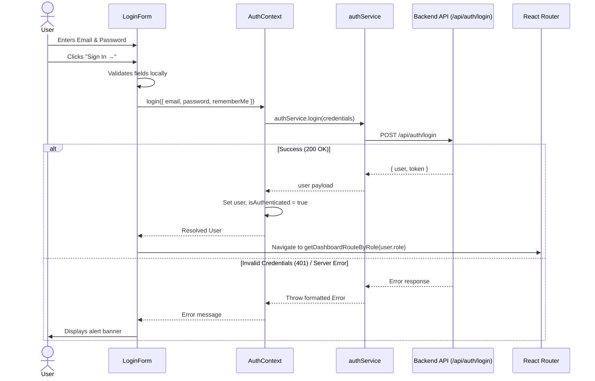

# RetailEdge AI — Login Page Documentation

## 1. Overview
- **Route**: `/login`
- **Purpose**: Centralized authentication entry point for the RetailEdge AI enterprise retail intelligence platform.
- **Architectural Pattern**: Split-screen responsive layout with glassmorphic marketing panel and secure credentials authentication card.

---

## 2. UI Sections & Visual Composition

### A. Left Marketing Panel (~60% Viewport Width)
1. **Header**:
   - **Branding**: `BrandLogo` with shopping cart and green leaf emblem, "RetailEdge AI" in crisp white and emerald green.
   - **Tagline**: *"Smarter Stores. Happier Customers."*
2. **Main Marketing Headline**:
   - *"AI-powered Retail Intelligence for **Smarter Stores**"* (with vibrant green accent styling `#3edc85`).
3. **Value Proposition Description**:
   - *"Monitor shelves, understand customers, manage queues and get real-time insights — all in one platform."*
4. **Feature Grid (7 Translucent Dark Glass Cards)**:
   - **Shopper Analytics**: Footfall, dwell time, heatmaps (`BarChart2`)
   - **Inventory Monitoring**: Real-time shelf & stock tracking (`Box`)
   - **Queue Intelligence**: Predict & reduce waiting time (`Users`)
   - **Planogram Compliance**: Ensure correct product placement (`ClipboardList`)
   - **Alerts & Notifications**: Instant real-time alerts (`Bell`)
   - **Reports & Analytics**: Data-driven decisions (`LineChart`)
   - **Camera Management**: Manage and monitor all cameras (`Camera`)
5. **Bottom Statistics (4 Metric Cards)**:
   - **500+** Stores Monitored
   - **1M+** Daily Visitors
   - **99%** Shelf Accuracy
   - **30%** Less Queue Time

### B. Right Authentication Card (~40% Viewport Width)
1. **Card Container**: Centered white card with `rounded-[28px]`, subtle soft shadow, and border.
2. **Card Header**:
   - `BrandLogo` (light theme)
   - Title: *"Sign in to your account"*
   - Subtitle: *"Access your dashboard and manage your stores"*
3. **Form Fields**:
   - **Email**: Mail icon, placeholder `admin@store.com`, format validation.
   - **Password**: Lock icon, placeholder `••••••••••••`, password toggle eye icon.
4. **Options Row**:
   - **Remember me**: Custom styled retail green checkbox.
   - **Forgot password?**: Direct link to administrative reset instructions.
5. **Primary Action**:
   - **"Sign In →"**: Deep retail forest green (`#1b5336`), hover and active states, loading spinner indicator during submission.
6. **Divider & Single Sign-On**:
   - *"Or continue with"*
   - **Google** SSO button with official 4-color vector logo.
   - **Microsoft** SSO button with official 4-square vector logo.
7. **Footer**:
   - *"New to RetailEdge AI? Contact your administrator."*

---

## 3. Component Architecture

All components reside in modular files:

| Component | File Path | Purpose |
| :--- | :--- | :--- |
| `BrandLogo` | `src/components/auth/BrandLogo.tsx` | Reusable SVG emblem (cart + leaf) and typography for light/dark themes |
| `FeatureCard` | `src/components/auth/FeatureCard.tsx` | Translucent glassmorphic card for left panel features |
| `StatCard` | `src/components/auth/StatCard.tsx` | Translucent glassmorphic metric card for bottom statistics |
| `SocialLoginButton` | `src/components/auth/SocialLoginButton.tsx` | Google & Microsoft SSO button wrappers |
| `LoginForm` | `src/components/auth/LoginForm.tsx` | Form state, validation, password toggle, error banners, submission |
| `AuthLayout` | `src/components/auth/AuthLayout.tsx` | Two-column split screen desktop and adaptive mobile layout |
| `ProtectedRoute` | `src/components/auth/ProtectedRoute.tsx` | Client-side route guard enforcing authentication & roles |
| `Login` | `src/pages/auth/Login.tsx` | Page controller connecting AuthContext, LoginForm, and navigation |

---

## 4. API Endpoints & Contracts

### 1. `POST /api/auth/login`
- **Status**: `[CONTRACT ONLY - READY FOR BACKEND]`
- **Purpose**: Authenticates user credentials and establishes a session.
- **Authentication**: Public (no credentials required).
- **Request Body**:
  ```json
  {
    "email": "user@retailstore.com",
    "password": "SecretPassword123",
    "rememberMe": true
  }
  ```
- **Expected Success Response (`200 OK`)**:
  ```json
  {
    "user": {
      "id": "usr_68f8a10bc",
      "name": "Sarah Jenkins",
      "email": "sarah.j@store.com",
      "role": "STORE_MANAGER",
      "organizationId": "org_supermart_01"
    },
    "token": "eyJhbGciOiJIUzI1NiIsInR5cCI6..."
  }
  ```
  *(Note: If backend uses HTTP-only cookies, the token may be set via `Set-Cookie: token=...; HttpOnly; SameSite=Lax`)*.
- **Error Responses**:
  - `400 Bad Request`: Validation failure (missing fields).
  - `401 Unauthorized`: Invalid credentials (`{ "message": "Invalid email or password." }`).
  - `403 Forbidden`: Account suspended or organization inactive.
  - `500 Internal Server Error`: Internal failure (`{ "message": "Server temporarily unavailable." }`).

### 2. `POST /api/auth/logout`
- **Status**: `[CONTRACT ONLY - READY FOR BACKEND]`
- **Purpose**: Invalidates session cookie / JWT token.
- **Authentication**: Authenticated user.
- **Expected Response**: `200 OK` (`{ "message": "Logged out successfully" }`).

### 3. `GET /api/auth/me`
- **Status**: `[CONTRACT ONLY - READY FOR BACKEND]`
- **Purpose**: Session restoration upon browser reload or cold start.
- **Authentication**: Session cookie or Bearer token.
- **Expected Success Response (`200 OK`)**:
  ```json
  {
    "user": {
      "id": "usr_68f8a10bc",
      "name": "Sarah Jenkins",
      "email": "sarah.j@store.com",
      "role": "STORE_MANAGER"
    }
  }
  ```
- **Unauthenticated Response**: `401 Unauthorized`.

---

## 5. Frontend Service Layer (`src/services/authService.ts`)

The service provides clean abstraction without coupling UI components to Axios or network details:
- `authService.login(credentials: LoginCredentials): Promise<AuthResponse>`
- `authService.logout(): Promise<void>`
- `authService.getCurrentUser(): Promise<User | null>`

API Client (`src/services/apiClient.ts`):
- Configured with `withCredentials: true` to support HTTP-only cookie architectures.
- Extracts clean human-readable error messages without leaking internal stack traces.

---

## 6. Authentication & Navigation Flow



---

## 7. Supported Roles & Route Redirection

Centralized in `src/utils/authRedirect.ts`:

| Role Key | Description | Target Route |
| :--- | :--- | :--- |
| `ADMIN` | Multi-store root administrator | `/admin` |
| `REGIONAL_MANAGER` | Regional multi-store operations manager | `/manager` |
| `STORE_MANAGER` | Individual store manager | `/manager` |
| `STAFF` | Floor employee and alert respondent | `/staff` |
| Fallback / Default | General authenticated user | `/dashboard` |

---

## 8. Form Validation & Error Handling
1. **Email**:
   - Required check.
   - Standard email format regex (`^[^\s@]+@[^\s@]+\.[^\s@]+$`).
2. **Password**:
   - Required check.
   - Minimum 6 characters length.
3. **Interactive Password Toggle**:
   - Screen-reader accessible toggle button switching between `type="password"` and `type="text"`.
4. **Backend Error Handling**:
   - Gracefully intercepts HTTP 401, 403, 500, or network offline scenarios.
   - Displays a clean red dismissible alert banner.

---

## 9. Responsive Behavior
- **Desktop (≥ 1024px)**: 60/40 split screen. Full retail background with darkened vignette, 7 feature glass cards, 4 bottom statistics cards, and centered right login card.
- **Tablet (768px – 1023px)**: Left panel features collapse into single or double columns with reduced padding.
- **Mobile (< 768px)**: Left marketing panel adjusts gracefully; the right login card fills comfortable screen width with full touch-friendly hit targets (≥ 44px) and zero horizontal overflow.

---

## 10. Pending Backend Integration

| Item | Status | Action Required from Backend Teammate |
| :--- | :--- | :--- |
| `POST /api/auth/login` | **CONTRACT ONLY** | Implement credential validation and return user + token or set HTTP-only cookie. |
| `GET /api/auth/me` | **CONTRACT ONLY** | Implement session restoration endpoint returning user info from active cookie/token. |
| `POST /api/auth/logout` | **CONTRACT ONLY** | Clear HTTP-only session cookie. |
| Google / Microsoft SSO | **PENDING** | Backend OAuth routes (`/api/auth/google`, `/api/auth/microsoft`) or OAuth callback redirect URL. |
| Forgot Password | **PENDING** | Backend self-service password reset flow (`POST /api/auth/forgot-password`). Currently shows administrator contact notice. |
